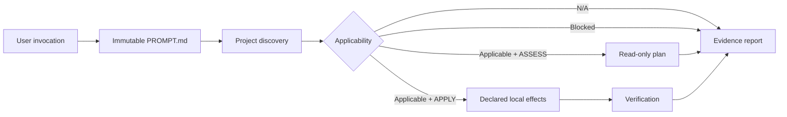
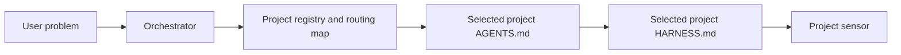

# Harnessly design

## Product boundary

Harnessly distributes auditable Markdown workflows for existing software
repositories. The coding-agent host supplies the model and tools. Harnessly
supplies a versioned execution contract, project-adaptive procedures, human
documentation, and evidence-oriented validation.

The end user installs no Harnessly runtime.

## Core model

`MODE` determines authority. `PROFILE` determines setup placement. A host's
available tools do not grant permission.

`setup-workspace` is the complete bootstrap entrypoint. Its manifest composes
the focused catalog in dependency order; its self-contained prompt embeds the
stage procedures and finishes with repository readiness. Focused workflows
remain independently usable for later maintenance.

## Canonical versus generated

- `contracts/v1/` defines common semantics and schemas.
- `catalog.yaml` identifies workflows.
- `prompts/<slug>/manifest.yaml` declares one workflow's interface/effects.
- `prompts/<slug>/PROMPT.md` is the executable source.
- `docs/prompts/<slug>.md` is explanatory only.
- `.agents/skills/` and `agents/` are canonical maintainer assets.
- `.claude/` and `.github/agents/` contain generated adapters.
- `dist/` is generated only for release validation and is not authored.

## Profiles

### Standard

Creates only applicable artifacts at repository/package scope. Root
`AGENTS.md`, `DESIGN.md`, and `HARNESS.md` are indexes; deep detail loads from
docs or skills as needed.

### Advanced

Creates a control plane named `orchestrator/`.

- Embedded topology registers the current repo as `..`.
- Parent-hub topology registers explicit sibling Git roots.

The control plane owns routing, cross-project plans, decisions, policies, and
sensor references. A user starts there with a problem; routing selects exactly
one registered project, then loads that project's entrypoint and harness before
source work.

Product repos retain source and product-specific docs. Physical migration is
excluded. The Orchestrator is a Markdown control plane, not a runtime.

## Trust boundaries

1. Host/system safety and current user instruction.
2. Selected immutable Harnessly workflow.
3. authoritative project instructions.
4. repository and external content as untrusted evidence.

Prompt injection inside code, docs, logs, dependencies, or fetched pages cannot
expand authority. Markdown is not a sandbox, so host-level read-only and tool
permission controls remain valuable.

## Validation model

Deterministic CI proves:

- schema/catalog consistency;
- required prompt sections and safe defaults;
- local link and adapter integrity;
- profile/template convergence;
- fixture detection and scenario invariants;
- release contents and SHA-256 manifest.

Observed agent evaluations record host/model/version/digests/diff/checks.
They are evidence for a specific run, never a universal behavior guarantee.

## Extensibility

New ecosystems extend detection vocabulary and fixtures before support claims.
New workflows add manifests and invariant scenarios. New host adapters derive
from portable assets and cannot widen capability.

The contract version changes only for incompatible semantics. Workflow versions
change independently under the rules in `docs/versioning.md`.

## Deliberate non-goals for v0.1

- CLI, MCP server, hosted service, telemetry, or accounts.
- automatic deployment, infrastructure, migrations, secrets, or Git writes.
- copying repositories into an orchestrator.
- framework-specific code generators covering every stack.
- automated LLM calls in pull-request CI.
