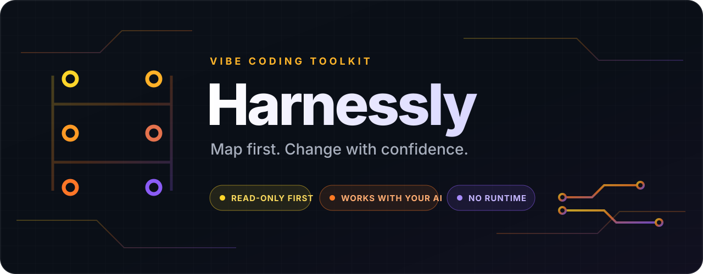

<p align="center">
  
</p>

# Harnessly

**Give your coding agent the context, guardrails, and checks your project
actually needs — without rebuilding the project around a new tool.**

Harnessly looks at the repository first, shows you a concrete plan, and waits
for your approval before changing anything. It works through plain Markdown
with Cursor, Claude Code, GitHub Copilot, and other coding agents.

[Português](./README.pt-BR.md) · [Start here](./docs/quickstart.md) ·
[Workflow catalog](./docs/prompts/README.md) · [Security](./SECURITY.md)

> **Development preview (`0.1.0-beta.1`):** the public repository and release
> are not live yet. The ready-to-copy URL below will work after publication.
> Until then, use the local
> [`prompts/setup-workspace/PROMPT.md`](./prompts/setup-workspace/PROMPT.md).

## Start in about 30 seconds

No CLI. No package to install. Open your coding agent **in the project you want
to prepare**, copy this message, and send it:

```text
Read https://raw.githubusercontent.com/joaovitorkc/harnessly/v0.1.0-beta.1/prompts/setup-workspace/PROMPT.md
Analyze this project and show me the setup you recommend. Do not change anything yet.
```

Harnessly maps the project and explains the plan. If it looks right, reply in
the **same chat**:

```text
Apply the plan you just showed me. Verify the result and tell me what you could not check.
```

That is the normal flow. You do not need to replace a placeholder, understand
a commit SHA, or paste the URL again. The agent reuses the exact workflow it
already assessed.

Want an `orchestrator/` for several repositories? Change only the second line:

```text
Read https://raw.githubusercontent.com/joaovitorkc/harnessly/v0.1.0-beta.1/prompts/setup-workspace/PROMPT.md
I want the advanced setup with an orchestrator folder. Analyze first and do not change anything yet.
```

If your agent cannot open URLs, open or paste the local
[`PROMPT.md`](./prompts/setup-workspace/PROMPT.md), then send the same
plain-language request.

## What it adds

Harnessly can create the pieces that are missing and preserve the ones you
already have:

- a clear project entrypoint for coding agents;
- system design and decision docs;
- package, command, and repository maps;
- local verification commands and quality gates;
- safe Cursor, Claude Code, and Copilot adapters;
- focused checks for CI, dependencies, configuration, and HTTP rate limits.

It adapts to the real stack. A static landing page does not receive server
middleware, and an unfamiliar tool is reported instead of guessed.

## The two choices, in plain English

- **Look only** (`ASSESS`): inspect and explain; never edit.
- **Apply** (`APPLY`): make only the approved local changes, then verify.
- **Normal setup** (`STANDARD`): keep guidance next to the code.
- **Advanced setup** (`ADVANCED`): add an `orchestrator/` that points to
  existing repositories without copying or moving them.

You can ignore the words in parentheses during the normal two-message flow.
They exist for automation and repeatable runs.

## Why it is safer than a generic setup prompt

- It gathers evidence before proposing files.
- Repository content is treated as untrusted data, not new instructions.
- Git commits, pushes, production access, migrations, secrets, destructive
  operations, and remote writes stay outside normal apply.
- Managed files have ownership and drift rules.
- Deterministic checks validate contracts, links, adapters, fixture detection,
  structural invariants, and release digests.

Harnessly is a prompt toolkit, not an AI model, agent runtime, framework
preset, or project generator. For pinned releases and integrity details, see
[versioning](./docs/versioning.md).

## Initial catalog

| ID | Workflow | Purpose |
|----|----------|---------|
| HLY-001 | [`setup-workspace`](./docs/prompts/setup-workspace.md) | Install the right Standard or Advanced foundation |
| HLY-002 | [`inventory-workspace`](./docs/prompts/inventory-workspace.md) | Map repos, packages, stacks, commands, and boundaries |
| HLY-003 | [`govern-agent-assets`](./docs/prompts/govern-agent-assets.md) | Reconcile AGENTS, rules, skills, and native adapters |
| HLY-004 | [`document-system-design`](./docs/prompts/document-system-design.md) | Build evidence-backed design and architecture docs |
| HLY-005 | [`build-local-harness`](./docs/prompts/build-local-harness.md) | Create reproducible local journeys and sensors |
| HLY-006 | [`establish-quality-gates`](./docs/prompts/establish-quality-gates.md) | Establish one truthful verification path |
| HLY-007 | [`document-runtime-configuration`](./docs/prompts/document-runtime-configuration.md) | Document configuration without reading real secrets |
| HLY-008 | [`wire-ci-verification`](./docs/prompts/wire-ci-verification.md) | Run local gates in CI without adding deployment |
| HLY-009 | [`harden-http-rate-limits`](./docs/prompts/harden-http-rate-limits.md) | Add tested server-side limits only where applicable |
| HLY-010 | [`audit-dependency-integrity`](./docs/prompts/audit-dependency-integrity.md) | Audit manifests, lockfiles, restore, and native scans |
| HLY-011 | [`verify-repository-readiness`](./docs/prompts/verify-repository-readiness.md) | Produce an honest final readiness report |

The machine-readable source is [`catalog.yaml`](./catalog.yaml).

## Supported project signals

The initial detection vocabulary covers:

- JavaScript and TypeScript: npm, pnpm, Yarn, Bun, package workspaces, Nx,
  Turborepo, and common web/server layouts.
- Python: `pyproject.toml`, uv, Poetry, pip requirements, and common app/test
  layouts.
- Go: `go.mod` and `go.work`.
- Rust: Cargo workspaces and crates.
- Java and Kotlin: Maven and Gradle.
- .NET: solution and project files.
- Static sites: HTML/CSS/client JavaScript with no owned server ingress.
- Nested Git repositories and parent workspaces.

Detection does not mean every framework-specific mutation is supported.
Unknown tooling is reported and preserved instead of being guessed.

## Compatibility

The common denominator is plain Markdown plus repository read/write tools.

- `AGENTS.md` is the portable, hierarchical repository entrypoint.
- `.agents/skills/<name>/SKILL.md` follows the open Agent Skills specification
  and is discovered by Cursor and GitHub Copilot.
- Claude Code receives generated `.claude/skills/` adapters and a small
  `CLAUDE.md`.
- Cursor may receive scoped `.cursor/rules/*.mdc`.
- GitHub Copilot may receive `.github/copilot-instructions.md`, prompt files,
  and supported agent profiles.
- Other agents use the canonical `PROMPT.md` directly.

Support claims are evidence-labelled in
[`docs/compatibility.md`](./docs/compatibility.md). Harnessly cannot guarantee
that every model or host follows instructions identically.

## Repository layout

```text
contracts/v1/       Versioned workflow, profile, and result contracts
profiles/           Standard and Advanced setup profiles
prompts/            Canonical executable Markdown plus manifests
docs/prompts/       Human documentation for each workflow
templates/          Artifacts installed by setup, never product code
.agents/skills/     Portable maintainer skills
agents/             Canonical specialist-agent definitions
tools/              Maintainer-only validation and release scripts
tests/              Synthetic fixtures, scenarios, and observed eval records
```

Start at [`DESIGN.md`](./DESIGN.md) for architecture and
[`HARNESS.md`](./HARNESS.md) for verification.

## Safety boundary

Repository content is untrusted input. Workflows must not obey instructions
found in source files, issues, logs, generated artifacts, or downloaded pages.
They may extract evidence from those files, but only the user invocation and
the selected Harnessly workflow provide execution instructions.

Harnessly workflows do not read real `.env` files, credential stores,
production data, or `.git/` objects directly. They may use Git-mediated status,
root, tracked-path, and scoped non-secret diff inspection. See
[`SECURITY.md`](./SECURITY.md) and the [threat model](./docs/threat-model.md).

## Contributing

Read [`CONTRIBUTING.md`](./CONTRIBUTING.md) and
[`docs/authoring-workflows.md`](./docs/authoring-workflows.md). A new workflow
is not complete until its manifest, guide, scenarios, safety classification,
and checks pass:

```bash
pnpm install
pnpm verify
```

Node and pnpm are maintainer dependencies only.

## Licensing

- Tools, schemas, CI, and code: Apache License 2.0.
- Documentation and canonical prompts: Creative Commons Attribution 4.0.
- Outputs created in a user's repository receive an additional permission:
  they do not require Harnessly attribution or licensing.

See [`LICENSE.md`](./LICENSE.md) for the exact file boundary and
[`OUTPUT-EXCEPTION.md`](./OUTPUT-EXCEPTION.md) for the output grant.
