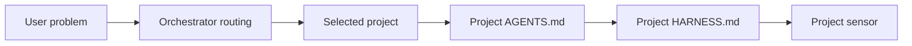

<!-- harnessly:owned workflow=document-system-design version=0.1.0 -->
# Design — {{WORKSPACE_NAME}} orchestrator

## Purpose

Coordinate documentation, routing, plans, decisions, and verification across
registered repositories without owning or duplicating their product code.

## Topology

`{{TOPOLOGY}}`

{{TOPOLOGY_DESCRIPTION}}

## Registered projects

The machine-readable source is `projects.yaml`.

{{PROJECT_SUMMARY}}

## Routing flow

Routing chooses context; it does not move code or run as a background service.

## Ownership

- Orchestrator owns cross-project process artifacts.
- Each project owns its source, product docs, native checks, and local agent
  instructions.
- Relative project paths are references, not import or build boundaries.

## Decisions and unknowns

{{DECISIONS_AND_UNKNOWNS}}
